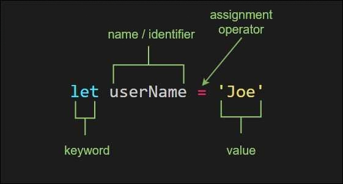
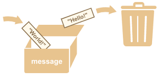

# Variables

Variables are a good place to start understanding communication between
developers and the computer. They are one tool a developer has to make a program
easier to read, and they are one way can you instruct computers to read & write
program memory.

You can think of variables
[like boxes](https://www.youtube.com/watch?v=Jvrszgiexg0) used to store data in
your programs. (_That video uses `var` but these programs use `let`. For now you
can think of them as the same thing._)

Study the JavaScript files in this folder to see the 4 main things you can do
with a variable:

- **Declaring**
- **Declaring and Initializing**
- **Assigning**
- **Reading**

---

Here's a helpful diagram of the syntax for variables in JavaScript:

[](https://blog.jordanholt.dev/learn-javascript-variables/)

---

A visual analogy: variables are a box with a label, and can only hold one thing
at a time.

[](https://javascript.info/variables)

```js
'use strict';

// declare the variable using let
// initialize the value: "Hello!"
let message = 'Hello!';

// assign a new value: "World!"
message = 'World!';

// read the stored value: "World!"
console.log(message);
```

And another little program to get you started:

```js
'use strict';

// declare the variable using let
// initialize the value: '.'
let dot = '.';

// read the stored value: '.'
// read the stored value: '.'
// assign a new value: '..'
dot = dot + dot;

// read the stored value: '..'
console.log(dot); // '..'
```

---

## Variable Names

The computer cannot understand what your variable names _mean_, to a computer
`let asdf = 'hello';` is same as `let greeting = 'hello';` . Variable names are
100% for developers to understand the code and 0% helpful for the computer.

Computers just care how you _use_ the variables:

- Where is it declared?
- Is it initialized?
- Where is it read?
- Where is it assigned a new value?

When the computer is interpreting your code it's these "patterns" that make one
set of instructions different from another, not the variable names.

Consider these two programs, they both have different variable names but the
same instructions. Commented above each line is how the computer will interpret
your code (or close enough for now). Can you find anything different between the
comments in each program?

---

```js
'use strict';

console.log('--- program 1 --- ');

// declare variable 1: let
// initialize variable 1: "hello"
let greeting = 'hello';

// declare variable 2: let
// initialize variable 2: "!"
let excitement = '!';

// read from variable 1: "hello"
// read from variable 2: "!"
// assign to variable 1: "hello!"
greeting = greeting + excitement;

// read from variable 1: "hello!"
console.log(greeting);
```

---

```js
'use strict';

console.log('--- program 2 --- ');

// declare variable 1: let
// initialize variable 1: "hello"
let x = 'hello';

// declare variable 2: let
// initialize variable 2: "!"
let y = '!';

// read from variable 1: "hello"
// read from variable 2: "!"
// assign to variable 1: "hello!"
x = x + y;

// read from variable 1: "hello!"
console.log(x);
```
